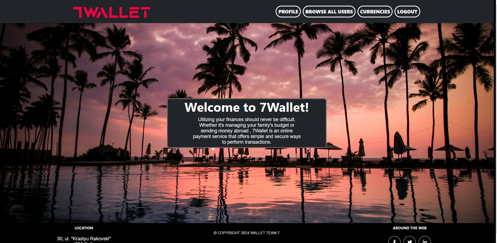

# 7Wallet

### An interactive web application that supports transfers between bank card  and a virtual wallet. The app supports transactions between different users, similarly to PayPal, Skrill etc..
### As of now, 7Wallet is in a developmental phase and has been partially deployed for demonstration purposes. Please contact us if you are interested.



## Table of contents:
- [Installation](#installation)
- [Usage](#usage)
- [Features](#features)

# Installation
***
### To install the application, you need to clone the repository to your local machine. 
1. #### Open a terminal on your device. (preferably git bash or an IDE terminal)
2. #### Clone the repository
Enter the following command in the terminal:\
``git clone https://github.com/TeamSevenWeb/7WALLET.git`` \
For GitHub CLI, you can enter the following:\
``gh repo clone TeamSevenWeb/7WALLET``
3. ####  Set up the database. 
In order to use the application, you need to configure the included SQL files with your preferred RDBMS.
4. #### If the dependencies do not get installed automatically, you can use:
``cd 7WALLET ./gradlew build`` or ``gradlew.bat build``


# Features
***
1. User Registration (with email verification)
2. User Login 
3. User password update
4. User personal details update (First Name, Last Name, Email, Phone Number, Profile Image)
5. Users can add cards
6. Users can add wallets.
7. Wallets can hold wallets in different currencies.
8. Users can add money to their wallets from their bank cards.
9. Users can perform transactions between one wallet and another (with email verification for big transactions)

# Usage
***
###  After installing the project, you can start the application using the following command in your terminal:

```bash
./gradlew bootRun
```

#### 7Wallet uses basic authentication for its RESTful controllers via headers with the following format:
Authentication: {username + " " + password}
